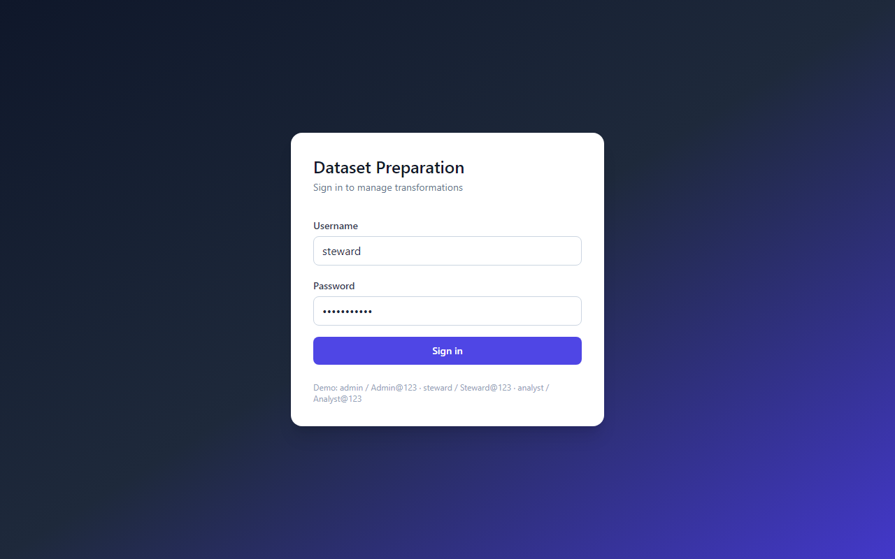
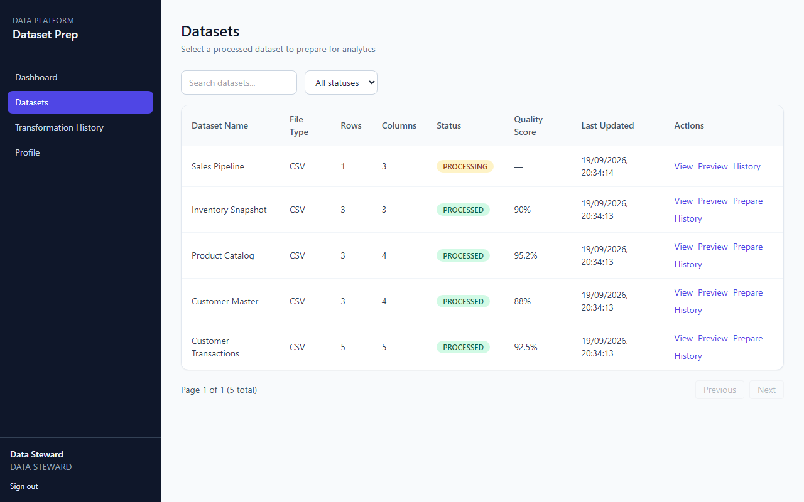
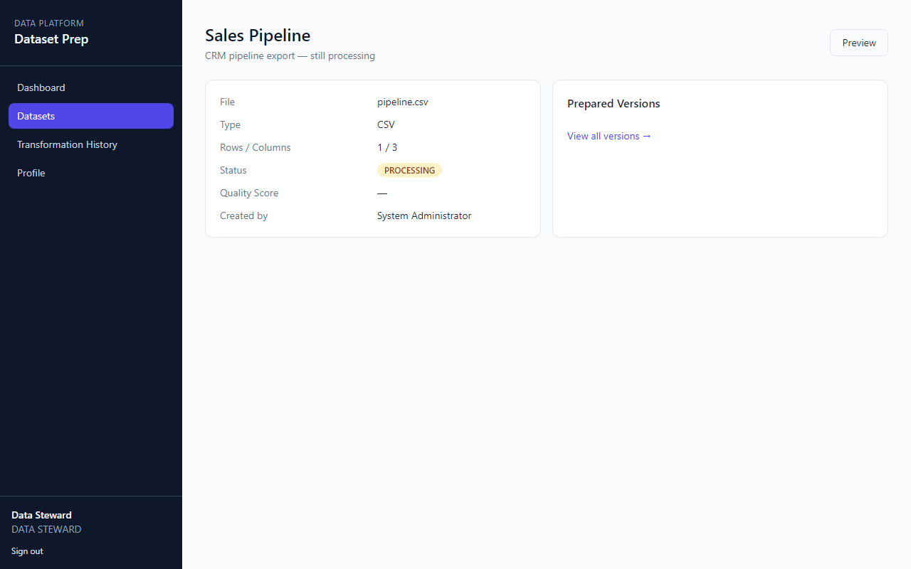
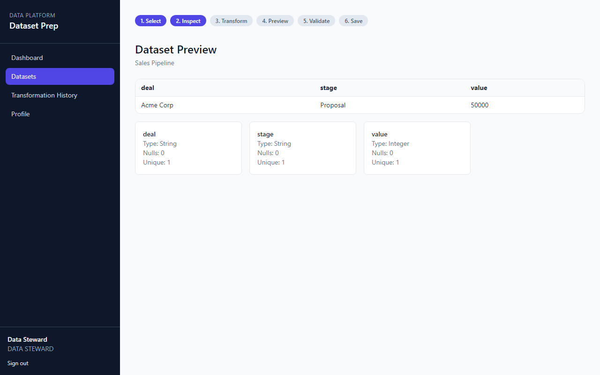
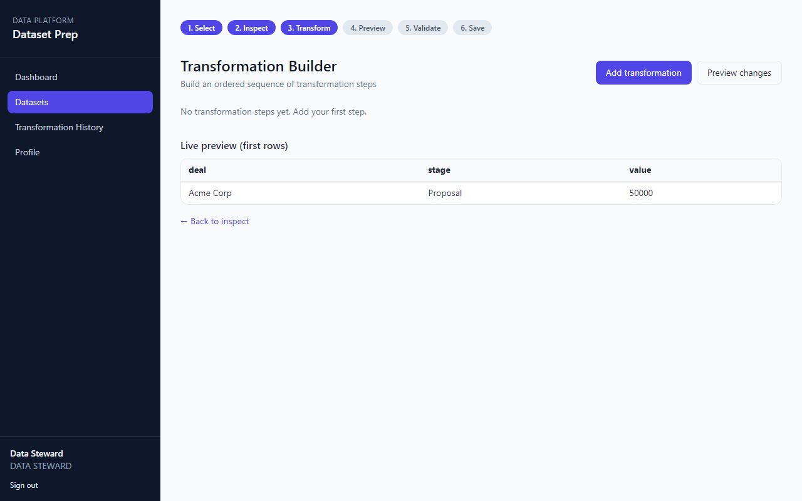
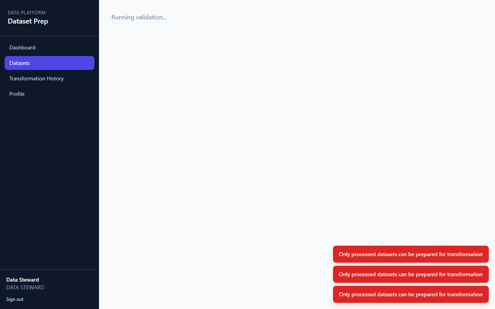
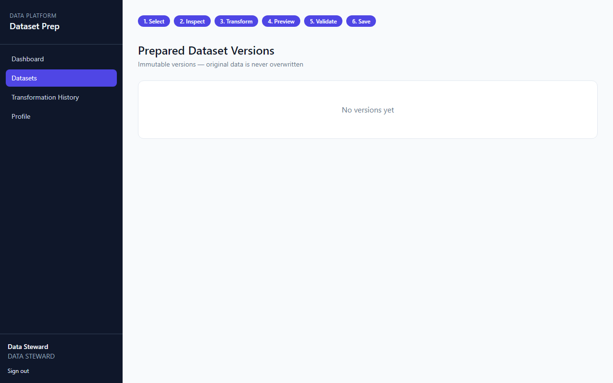
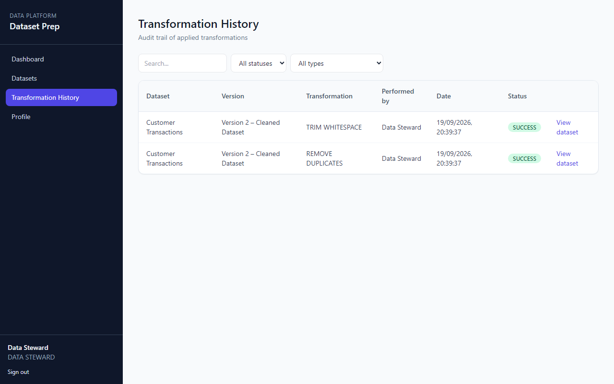
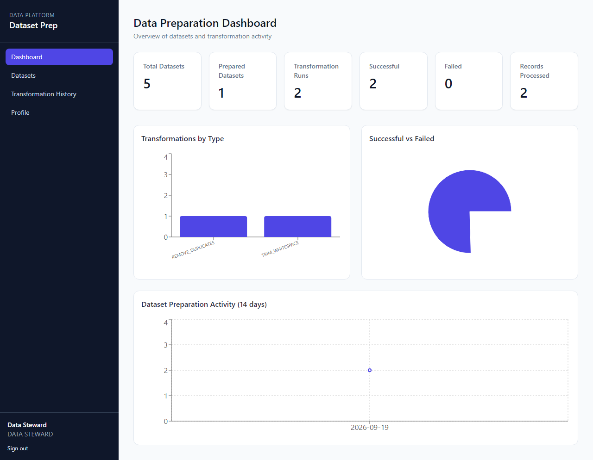

# Dataset Preparation & Transformation Module

**Author:** thestacklyvineshj

Full-stack application for selecting processed datasets, building transformation pipelines, validating results, and saving immutable prepared versions.

## Technologies

| Layer | Stack |
|--------|--------|
| Frontend | React 18, Vite, Tailwind CSS, Recharts, React Router, Axios |
| Backend | Node.js, Express, JWT, bcrypt |
| Metadata | JSON file store (local dev) — **MySQL 8** schema provided for production |
| Dataset snapshots | JSON files under `backend/data/` |

## Project structure

```
frontend/          React SPA
backend/           Express REST API
docker-compose.yml MySQL (optional)
README.md
docs/screenshots/  UI captures for submission
```

## Quick start (no Docker required)

Default mode uses a JSON metadata store at `backend/data/store.json` so you can run the app without installing MySQL.

```bash
# Backend
cd backend
npm install
npm run seed
npm run dev

# Frontend (new terminal)
cd frontend
npm install
npm run dev
```

- Frontend: http://localhost:5173  
- API: http://localhost:5000/api  

### Test credentials

| Username | Password | Role |
|----------|----------|------|
| admin | Admin@123 | Administrator |
| steward | Steward@123 | Data Steward |
| analyst | Analyst@123 | Data Analyst |

## MySQL setup (production / evaluation)

1. Start MySQL: `docker compose up -d` (or local MySQL 8).
2. Copy `backend/.env.example` to `backend/.env` and set `DB_*` credentials.
3. Apply schema: `mysql -u root -p < backend/sql/schema.sql`
4. For a MySQL-backed deployment, replace the repository layer in `backend/src/db/index.js` with `mysql2` queries matching `backend/sql/schema.sql` (the JSON layer mirrors the same tables and relationships).

## API overview

| Method | Path | Description |
|--------|------|-------------|
| POST | `/api/auth/login` | Login |
| GET | `/api/datasets` | List datasets (search, status, pagination) |
| GET | `/api/datasets/:id/preview` | Preview columns + 20 rows |
| POST | `/api/datasets/:id/transform` | Add draft transformation step |
| POST | `/api/datasets/:id/transformations/preview` | Preview pipeline impact |
| POST | `/api/datasets/:id/validate` | Run validation (Steward/Admin) |
| POST | `/api/datasets/:id/versions` | Save prepared version |
| GET | `/api/datasets/:id/history` | Dataset transformation history |
| GET | `/api/history` | Global history |
| GET | `/api/dashboard/data-preparation` | Dashboard metrics |

Full route list: [backend/src/routes/index.js](backend/src/routes/index.js)

## Database schema

See [backend/sql/schema.sql](backend/sql/schema.sql): `users`, `datasets`, `dataset_versions`, `transformations`, `transformation_history`, `validation_results`, `transformation_configs`.

## Supported transformations

- **Column:** rename, remove, change type (String, Integer, Decimal, Boolean, Date)
- **Missing values:** remove null rows, replace nulls
- **Text:** trim, uppercase, lowercase
- **Numeric:** round, add, multiply
- **Rows:** remove duplicates, filter by condition

Configurations are stored as JSON on each `transformations` row (`column_name` + `configuration` object).

## Transformation execution flow

1. Load **original** snapshot from `datasets/{id}.json` (never mutated in place).
2. Sort draft steps by `execution_order`.
3. Apply each operator in memory; abort on error (fail-fast).
4. Preview/validate operate on the in-memory result only.
5. On save: write **new** file under `versions/`, insert `dataset_versions`, copy steps linked to `version_id`, write history + validation, clear draft steps.

## Demo workflow

Login → Datasets → Customer Transactions → Preview → Prepare → add steps (e.g. remove duplicates, trim `customer_name`, replace null in `city`, round `amount`) → Preview changes → Validate → Save version → Versions / History.

## Screenshots

### Login



### Dataset list



### Dataset details



### Dataset preview



### Transformation builder



### Transformation preview


### Validation results



### Prepared dataset versions



### Transformation history



### Data preparation dashboard



## Write-up questions

**How did you design the transformation workflow?**  
A linear stepper (Select → Inspect → Transform → Preview → Validate → Save) maps to REST endpoints and draft `transformations` rows (`version_id` NULL until saved). The UI builder reorders steps via `execution_order`.

**How are multiple transformations executed in the correct order?**  
The engine sorts steps by `execution_order` and applies them sequentially to a cloned row set in [transformationEngine.js](backend/src/services/transformationEngine.js).

**How did you ensure the original dataset is not modified?**  
Source data lives in `backend/data/datasets/*.json`. Prepared output is written to a new path under `backend/data/versions/`; only metadata and new version records are inserted.

**How did you store transformation configurations?**  
Each step stores `transformation_type`, optional `column_name`, and a JSON `configuration` (e.g. `newName`, `targetType`, `fillValue`, filter operators).

**How would you handle a transformation that fails halfway?**  
The pipeline runs in memory only until save; on any step error it throws and leaves persisted files and draft steps unchanged (fail-fast, no partial file writes).

**How would you optimize for millions of records?**  
Stream/chunk reads, columnar storage (Parquet), push transforms to SQL/Spark, avoid full in-memory copies, index filter columns, and sample for UI preview only.

**How would you redesign for async background jobs?**  
Submit jobs to a queue (Redis/SQS), workers run pipelines on object storage, poll job status via WebSocket/SSE, store results as new versions when complete; API becomes orchestration-only.

## Demo video

Record a short screen capture of the demo workflow above and attach to your submission (not included in repo).
